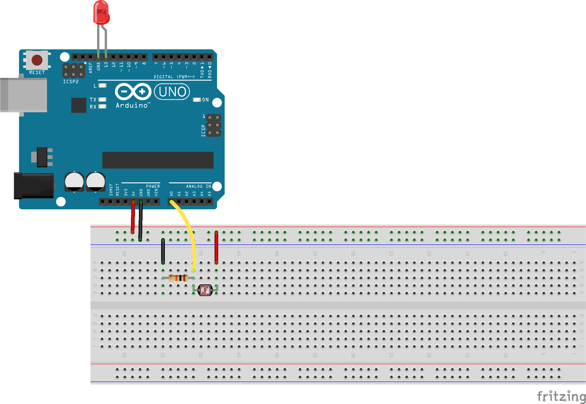

c2c
===

This sketches are part of the course ["Eingabe, Ausgabe. Grundlagen der prozessorientierten Gestaltung"](https://incom.org/workspace/4693) by Monika Hoinkis & Fabian Morón Zirfas

It shows basic computer 2 computer communication.  

##Komponents  

- Arduino IDE
- Processing IDE
- Light Dependend Resistor
- 10k Ohm Resistor
- LED

##prerequisites  
Set up your Arduino with a LDR (light dependend resistor) and the LED like this.  

- One LDR leg goes to the 5V pin 
- one LDR leg to the analog 0 pin
- connect the resistor to the analog 0 pin as well
- connect the other leg of the resitor to the GND pin
- connect the long leg of the LED to the 13 digital pin
- connect the short leg to the GND pin

  

##Port Detection  
Connect your Arduino Board to your computer adn use the sketck [processing/list_serial_ports.pde](/processing/list_serial_ports.pde) to see which port number is the one you chose in the Arduino IDE.  

##Processing 2 Arduino  

1. Check your ports
2. Upload sketch [arduino/c2c_incoming.ino](/arduino/c2c_incoming.ino) to your board  
3. open and run the processing sketch [processing/write_to_serial.pde](processing/write_to_serial.pde)  
4. by pressing UP and DOWN on your keyboard you can turn on a LED connected to pin 13  

##Arduino to Processing  

1. Check your ports
2. Upload sketch [arduino/c2c_outgoing.ino](arduino/c2c_outgoing.ino) to your board  
3. open and run the processing sketch [processing/read_from_serial.pde](processing/read_from_serial.pde)  
4. by waving your hand over the LDR you should be able to change the background color of the processing sketch.

##Poor Mans Oscilloscope  

written by @chrismeyersfsu with edits from @positron96  

1. check your ports
2. Upload sketch [arduino/poor_mans_oscilloscope.ino](arduino/poor_mans_oscilloscope.ino) to your board  
3. open and run the processing sketch [processing/poor_mans_oscilloscope.pde](processing/poor_mans_oscilloscope.pde)  

##License  
except Poor mans ocilloscope sketches

Copyright (c)  2013 FH-Potsdam & Fabian "fabiantheblind" Morón Zirfas  
Permission is hereby granted, free of charge, to any person obtaining a copy of this software and associated documentation files (the "Software"), to deal in the Software  without restriction, including without limitation the rights to use, copy, modify, merge, publish, distribute, sublicense, and/or sell copies of the Software, and to  permit persons to whom the Software is furnished to do so, subject to the following conditions:  
The above copyright notice and this permission notice shall be included in all copies or substantial portions of the Software.  
THE SOFTWARE IS PROVIDED "AS IS", WITHOUT WARRANTY OF ANY KIND, EXPRESS OR IMPLIED, INCLUDING BUT NOT LIMITED TO THE WARRANTIES OF MERCHANTABILITY, FITNESS FOR A  PARTICULAR PURPOSE AND NONINFRINGEMENT. IN NO EVENT SHALL THE AUTHORS OR COPYRIGHT HOLDERS BE LIABLE FOR ANY CLAIM, DAMAGES OR OTHER LIABILITY, WHETHER IN AN ACTION OF  CONTRACT, TORT OR OTHERWISE, ARISING FROM, OUT OF OR IN CONNECTION WITH THE SOFTWARE OR THE USE OR OTHER DEALINGS IN THE SOFTWARE.  

see also http://www.opensource.org/licenses/mit-license.php

##Poor mans ocilloscope
is under GNU General Public License  

(c) 2008 Sofian Audry (info@sofianaudry.com)  
This program is free software: you can redistribute it and/or modify
it under the terms of the GNU General Public License as published by
the Free Software Foundation, either version 3 of the License, or
(at your option) any later version.  

This program is distributed in the hope that it will be useful,
but WITHOUT ANY WARRANTY; without even the implied warranty of
MERCHANTABILITY or FITNESS FOR A PARTICULAR PURPOSE.  See the
GNU General Public License for more details.  

You should have received a copy of the GNU General Public License  
along with this program.  If not, see <http://www.gnu.org/licenses/>.  

